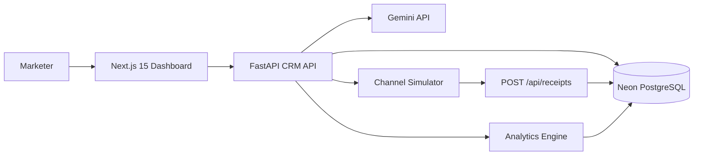

# Architecture

## Components

- Frontend: modern dark SaaS dashboard with Overview, Customers, AI Segments, Campaigns, AI Copilot, and Analytics.
- CRM API: owns customers, orders, campaigns, communications, receipts, AI orchestration, analytics, and segmentation.
- Gemini service: generates campaign strategy and content when `GEMINI_API_KEY` is configured.
- Channel simulator: separate FastAPI service that accepts recipient, message, channel, callback URL, and asynchronously posts receipt events.
- Analytics engine: computes sent, delivered, opened, read, clicked, converted, rates, and estimated revenue.

## Data Flow

1. Marketer enters a goal in AI Copilot.
2. API converts the goal into audience filters and campaign strategy.
3. Marketer launches the campaign.
4. API creates communications and sends each one to the channel simulator.
5. Simulator posts lifecycle events back to `/api/receipts`.
6. Analytics are updated from stored events.
