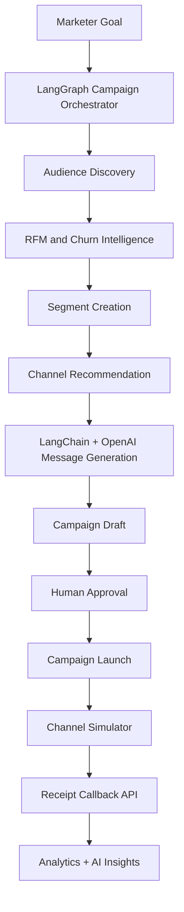

# Agentic Marketing CRM

An AI-native marketing CRM that transforms business goals into customer segments, personalized campaigns, and actionable insights using Agentic AI, LangGraph, and LangChain.

---

Xeno AI Growth Agent is an AI-native mini CRM for shopper engagement and marketing automation. It helps marketers understand customer behavior, create intelligent segments, generate personalized campaigns, execute through simulated channels, track engagement, and learn from outcomes.

## Why This Fits Xeno

Xeno helps brands grow revenue through smarter customer engagement. This project is designed around that exact loop: customer intelligence, audience discovery, campaign generation, channel execution, receipt tracking, and AI insight generation. The product is not a CRUD CRM; it behaves like an agentic marketing operator.

## Demo

### Live Application

[Add deployed frontend URL]

### Walkthrough Video

[Add YouTube or Google Drive walkthrough link]

### GitHub Repository

[Add GitHub repository link]

---

## AI-Native Workflow



## Agentic Architecture

The backend uses **LangGraph** to model the campaign workflow as explicit nodes and **LangChain** with OpenAI for goal interpretation and campaign generation.

Agent nodes:

- Goal Analysis
- Audience Discovery
- Customer Intelligence
- Segment Creation
- Channel Recommendation
- Message Generation
- Campaign Draft
- Human Approval
- Campaign Launch
- Analytics Collection
- AI Insights

## Why This Is Agentic AI

This project does not use AI merely for content generation.

A LangGraph-powered Campaign Orchestrator acts as an autonomous marketing agent.

The agent receives a business goal, reasons through multiple decision-making stages, invokes customer intelligence tools, creates audience segments, recommends communication channels, generates personalized campaign content, predicts campaign performance, and produces actionable insights.

LangChain is used for AI reasoning and goal interpretation, while LangGraph manages workflow execution and state transitions across the campaign lifecycle.

This transforms the CRM from a passive management tool into an active AI-powered marketing copilot.

---

## Stack

- Frontend: Next.js 15, TypeScript, Tailwind CSS, shadcn-style components, Recharts, Framer Motion
- CRM API: Node.js, Express.js, TypeScript
- Database: MongoDB + Mongoose
- AI: OpenAI API, LangChain, LangGraph
- Channel simulator: independent Node.js/Express service with async callbacks
- Deployment: Vercel frontend, Render/Railway backend services

## Features

- Executive dashboard with KPIs, revenue attribution, top cities, high churn customers, customer segments, and AI recommendations
- Customer intelligence engine with RFM scoring, health score, lifecycle segment, and churn risk
- AI Segment Builder that converts natural language into MongoDB-ready rules
- LangGraph Campaign Orchestrator exposed at `POST /api/agent/run`
- Channel recommendation engine with explainability
- Advanced personalization variables: `{{name}}`, `{{city}}`, `{{lastPurchase}}`, `{{totalSpend}}`, `{{rfmSegment}}`
- Campaign creation, launch, and callback-driven lifecycle tracking
- Channel Simulator for WhatsApp, SMS, Email, and RCS
- Analytics dashboard with sent, delivered, opened, read, clicked, converted, open rate, CTR, and conversion rate
- AI Insights page with executive summaries and next-best actions

## API Overview

CRM API base URL: `http://localhost:8000/api`

- `GET /health`
- `GET /dashboard`
- `GET /customers`
- `GET /customers/:id`
- `POST /segments/preview`
- `POST /segments`
- `GET /segments`
- `POST /ai/message`
- `POST /copilot`
- `POST /agent/run`
- `POST /campaigns`
- `POST /campaigns/:id/launch`
- `POST /receipt`
- `GET /analytics`
- `GET /insights`

Channel simulator base URL: `http://localhost:8010`

- `GET /health`
- `POST /send`

## Screenshots

### Dashboard


### AI Copilot


### Customer Intelligence


### Segment Builder


### Analytics


### Architecture


## Local Setup

Start MongoDB locally, or set `MONGODB_URI` to MongoDB Atlas.

**Terminal 1: CRM API**

```powershell
cd "C:\Users\ginja\Downloads\CRM project\services\node-api"
npm install
copy .env.example .env
npm run seed
npm run dev
```

**Terminal 2: Channel Simulator**

```powershell
cd "C:\Users\ginja\Downloads\CRM project\services\node-channel-simulator"
npm install
copy .env.example .env
npm run dev
```

**Terminal 3: Frontend**

```powershell
cd "C:\Users\ginja\Downloads\CRM project\apps\web"
npm install
npm run dev
```

Open `http://localhost:3000`.

## Deployment Guide

- Deploy `apps/web` to Vercel.
- Deploy `services/node-api` to Render or Railway.
- Deploy `services/node-channel-simulator` to Render or Railway.
- Use MongoDB Atlas for production.
- Set `NEXT_PUBLIC_API_URL` in Vercel to the deployed CRM API URL.
- Set `CHANNEL_SERVICE_URL` and `PUBLIC_API_URL` in the CRM API service.

## Scale Assumptions

Current design uses direct API calls for clarity and take-home demo speed. At scale:

- Use Kafka or RabbitMQ for campaign communication events.
- Use Redis queues for delivery simulation and receipt processing.
- Move campaign launch to background workers.
- Add event streaming for analytics.
- Add materialized analytics collections for fast dashboards.
- Add idempotency keys for callbacks.
- Add tenant isolation and role-based access control.

## Business Impact

Agentic Marketing CRM helps organizations:

- Improve customer retention
- Reduce churn
- Increase campaign effectiveness
- Automate audience discovery
- Personalize communication at scale
- Accelerate marketing decision-making

---

## Future Improvements

- Real authentication and multi-tenant workspace model
- Production queue workers for campaign sending
- Fine-tuned customer embeddings for segment recommendations
- A/B testing and holdout groups
- Real provider integrations for WhatsApp, SMS, Email, and RCS
- More advanced churn and conversion models
